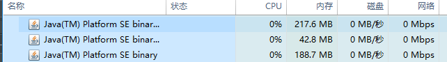
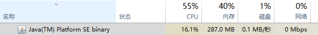
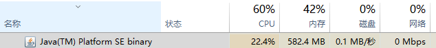
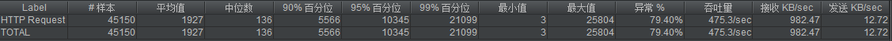

# Task 2: Find the resource consumption of your REST service
1. 引言
   * 使用jmeter模拟多用户并发请求给服务器后端，比对其CPU调用以及内存损耗情况
   * 文档作者：BlackAngle
2. 测试情况
   * 无请求状态
    
   * 每秒发送一个请求
    
    
    * 每秒发送十个请求
    
    
    * 每秒发送一百个请求
    
    
    * 每秒发送一千个请求
    
    
    * 每秒发送一万个请求
    
    
3. 思考与猜测
    * 可以看出，CPU占用率起先呈不断上升状态，而超过一百后开始下降
    * 内存占用率和CPU占用率基本成正比
    * 同时，异常率随着请求数量的增多
    * 我猜想随着每秒请求数量的增多，请求丢失率也大大增加，也就是异常率不断上升。而异常率上升，就导致服务器实际接收到的请求数量减少，因而CPU占用率不升反降
    * 此外，我还发现一个现象： 在每次测试开始的几秒甚至十几秒内，异常率一直保持为0，即一小段时间的压力，正常服务器是可以承受的，但在长时间的多请求访问后，服务器就会变得不稳定起来